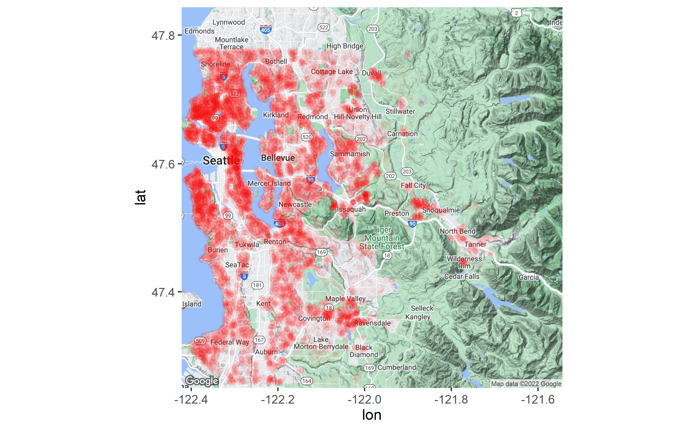

```{r setup, include=FALSE}
knitr::opts_chunk$set(echo = TRUE)
rm(list = ls())
library(tidyverse)
library(dplyr)
library(GGally)
library(ggpubr)
library(ggmap)
library(faraway)
library(MASS)
```


## 0. Abstract


## 1. Introduction

The website Kaggle.com, an online community of data scientists, offers many clean, formatted data sets on which analysis can be performed. For this project, I used the Kaggle data set, “House Sales in King County, USA” which includes all home sales from May 2014 to May 2015. The city of Seattle, Washington, USA lies on the border of Kings County. Seattle is notorious for having some of the most expensive and lavish homes in the United States. The data set has a wide variety of homes ranging from small homes to massive mansions containing over 30 rooms. 

```{r cars}
house <- read.csv('kc_house_data.csv')
head(house)
```

```{r}
#p1 <- get_googlemap("king county") %>% ggmap
#p1 + geom_point(data = house, aes(x = long, y = lat), alpha = 0.03, colour = "red")
#ggsave("map.png")
```

```{r}

```


## 2. Settings

Below are the entire columns in this dataset:

- id: Unique ID for each home sold 
- date: Date of the home sale 
- price: Price of each home sold
- bedrooms: Number of bedroom 
bathrooms: Number of bathrooms, where .5 accounts for a room with a toilet but no shower
- sqft_living: Square footage of the apartments interior living space 
- sqft_lot: Square footage of the land space
- floors: Number of floors
- waterfront: A dummy variable for whether the apartment was overlooking the waterfront or not 
- view: An index from 0 to 4 of how good the view of the property was 
- condition: An index from 1 to 5 on the condition of the apartment,
- grade: An index from 1 to 13, where 1-3 falls short of building construction and design, 7 has an average level of                      construction and design, and 11-13 have a high quality level of construction and design.
- sqft_above: The square footage of the interior housing space that is above ground level 
- sqft_basement: The square footage of the interior housing space that is below ground level 
- yr_built: The year the house was initially built
- yr_renovated: The year of the house’s last renovation
- zipcode: What zipcode area the house is in 
- lat: Latitude 
- long: Longitude 
- sqft_living15: The square footage of interior housing living space for the nearest 15 neighbors 
- sqft_lot15: The square footage of the land lots of the nearest 15 neighbors


As id, date, latitude, longitude, and zipcode are unnecessary columns for analysis, let's just drop them.

```{r}
house <- house %>% dplyr::select(-id, -date, -lat, -long, -zipcode)
head(house)
```
In datset, there are total 21,613 obeservations, and 16 columns with no missing values.

```{r}
nrow(house) 
ncol(house)
is.null(house)
```

Let's reorder columns to make the dataset more readable.

```{r}
col_order <- c("price", "bedrooms", "bathrooms", "floors", "waterfront", "view", "condition", "grade", "yr_built",
               "yr_renovated", "sqft_living", "sqft_lot", "sqft_living15", "sqft_lot15")
house <- house[, col_order]
```


According to our dataset, bathrooms column had some decimal observations, so let's round it up.

As yr_built and renovated are columns are continuous variables, each of them stating the year of a house built / renovated, let's just convert them into categorical variables. For yr_built, we can chunk it up to 5 categories with 20 years of interval, and for renovated, we can note them 1, if renovated, 0 otherwise.

```{r}
house$bathrooms <- round(house$bathrooms)

house$yr_built <- case_when(
  (1900 <= house$yr_built) &  (house$yr_built< 1920) ~ 0,
  (1920 <= house$yr_built) &  (house$yr_built< 1940) ~ 1,
  (1940 <= house$yr_built) &  (house$yr_built< 1960) ~ 2,
  (1960 <= house$yr_built) &  (house$yr_built< 1980) ~ 3,
  (1980 <= house$yr_built) &  (house$yr_built< 2000) ~ 4,
  (2000 <= house$yr_built) ~ 5)

house$renovated <- ifelse(house$yr_renovated != 0, 1, 0)

house <- house %>% dplyr::select(-yr_renovated)
```


Before diving into EDA, let's split the dataset into train data and test data.

```{r}
set.seed(1) ##for reproducibility to get the same split
sample<-sample.int(nrow(house), floor(.80*nrow(house)), replace = F)
train<-house[sample, ] ##training data frame
test<-house[-sample, ] ##test data frame
head(train)
```


## 3. Exploratory Data Analysis

By using ggpairs, we can check overall relationship among columns with the repsonse variable, price, and distribution of each column.

First, for physical attributes of houses (bedrooms, bathrooms, and floors), bathrooms had pretty good correlation with price. Slightly lesser for bedrooms and floors.

```{r}
house_1 <- train %>% dplyr::select(price, bedrooms, bathrooms, floors)
ggpairs(house_1)
```

By looking at boxplot across each colum and category, price did not necessarily proportional to number of bedrooms and number of floors. In short, the most pricy house did not have the largest number of bedrooms or floors. However, in terms of number of bathrooms, price tend to increase as the number of bathroom increases. In our dataset, the most pricy house had the largest number of bedrooms. This is the reason why among these three columns, bathrooms had the highest corrleation with price. 

```{r}
p1 <- ggplot(train, aes(x = as.factor(bedrooms), y = price, fill = as.factor(bedrooms))) +
  geom_boxplot() +
  labs(x = "Number of Bedrooms", y = "Price", title = "Price by Number of Bedrooms", fill = "Bedrooms")

p2 <- ggplot(train, aes(x = as.factor(bathrooms), y = price, fill = as.factor(bathrooms))) +
  geom_boxplot() +
  labs(x = "Number of Bathrooms", y = "Price", title = "Price by Number of Bathrooms", fill = "Bathrooms")

p3 <- ggplot(train, aes(x = as.factor(floors), y = price, fill = as.factor(floors))) +
  geom_boxplot() +
  labs(x = "Number of Floors", y = "Price", title = "Price by Number of Floors", fill = "Floors")

ggarrange(p1, p2, p3,
                    ncol = 1, nrow = 3)
```


Other three columns (view, condition, waterfront), there was a slight correlation between view and price (0.395). There was also somewhat slight correlation between waterfront and price (0.273). What's notable is here is that the condition and price of a house had nearly zero correlation (0.015). However, we should be careful when analyzing this figure as nearly zero correlation does not necessarily mean they are totally unrelated, and high correlation does not necessarily lead to a causation, A causes B, or the opposite.

```{r}
house_2 <- train %>% dplyr::select(waterfront, view, condition, price)
ggpairs(house_2)
```

According to the boxplot, houses with in the vicinity of waterfront and good view tend to be pricy. However, the condition of a house was not a crucial factor.

```{r}
p4 <- ggplot(train, aes(x = as.factor(waterfront), y = price, fill = as.factor(waterfront))) +
  geom_boxplot() +
  labs(x = "Waterfront", y = "Price", title = "Price by with / without waterfront", fill = "Waterfront")

p5 <- ggplot(train, aes(x = as.factor(view), y = price, fill = as.factor(view))) +
  geom_boxplot() +
  labs(x = "View", y = "Price", title = "Price by View", fill = "View")

p6 <- ggplot(train, aes(x = as.factor(condition), y = price, fill = as.factor(condition))) +
  geom_boxplot() +
  labs(x = "Condition", y = "Price", title = "Price by Condition", fill = "Condition")

ggarrange(p4, p5, p6, ncol = 1, nrow = 3)
```


It turns out that among three columns, grade of a house had a notably high correlation with price. Also, yr_built had pretty notable correlation with price. However, renovated had low correlation with price. 

```{r}
house_3 <- train %>% dplyr::select(grade, yr_built, renovated, price)
ggpairs(house_3)
```

According to the boxplot, there exists a gradual increase in price along grade categories. Also, more newly-built houses tend to have slightly higher prices. However, there was no big difference in price between renovated house and unrenovated house.

```{r}
p7 <- ggplot(train, aes(x = as.factor(grade), y = price, fill = as.factor(grade))) +
  geom_boxplot() +
  labs(x = "Grade", y = "Price", title = "Price by Grade", fill = "Grade")

p8 <- ggplot(train, aes(x = as.factor(yr_built), y = price, fill = as.factor(yr_built))) +
  geom_boxplot() +
  labs(x = "Year built", y = "Price", title = "Price by Year built", fill = "Year built")

p9 <- ggplot(train, aes(x = as.factor(renovated), y = price, fill = as.factor(renovated))) +
  geom_boxplot() +
  labs(x = "Renovated", y = "Price", title = "Price by Renovated", fill = "Renovated")

ggarrange(p7, p8, p9, ncol = 1, nrow = 3)
```

When we take a look at sqft_lot and sqft_living columns, sqft_living had a pretty high correlation with price. Houses with large square foot of living generally had higher prices. However, sqft_lot was not highly correlated with price.

```{r}
house_4 <- train %>% dplyr::select(sqft_living, sqft_lot, price)
ggpairs(house_4)
```

As such, the slope of sqft_living was pretty steep, while that of sqft_lot was more flat.

```{r}
p10 <- ggplot(train, aes(x = sqft_living, y = price)) +
  geom_point() +
  geom_smooth(method = "lm", se = FALSE) +
  labs(x = "Sqft Living", y = "Price", title = "A Scatterplot of Sqft Living vs Price") 

p11 <- ggplot(train, aes(x = sqft_lot, y = price)) +
  geom_point() +
  geom_smooth(method = "lm", se = FALSE) +
  labs(x = "Sqft Lot", y = "Price", title = "A Scatterplot of Sqft Lot vs Price")


ggarrange(p10, p11, ncol = 1, nrow = 2)
```

In line with sqft columns, sqft_living15 also had pretty notable correlation with price, while sqft_lot15 not.

```{r}
house_5 <- train %>% dplyr::select(sqft_living15, sqft_lot15, price)
ggpairs(house_5)
```

Likely, sqft_living15 column had slightly steeper slope than that of sqft_lot15.

```{r}
p12 <- ggplot(train, aes(x = sqft_living15, y = price)) +
  geom_point() +
  geom_smooth(method = "lm", se = FALSE) +
  labs(x = "Sqft Living15", y = "Price", title = "A Scatterplot of Sqft Living 15 vs Price") 

p13 <- ggplot(train, aes(x = sqft_lot15, y = price)) +
  geom_point() +
  geom_smooth(method = "lm", se = FALSE) +
  labs(x = "Sqft Lot15", y = "Price", title = "A Scatterplot of Sqft Lot 15 vs Price")


ggarrange(p12, p13, ncol = 1, nrow = 2)
```


On top of direct correlation with price, through heatmap, we can check general corrleation among each column. The more red-shaded the square is, the higher correlated two predictors are. On bottom right, predictors (bedrooms, bathrooms, sqft_living, grade, and sqft_living) seem to be pretty correlated with each other.

```{r}
mydata.cor <- cor(house)

palette = colorRampPalette(c("green", "white", "red")) (20)
heatmap(x = mydata.cor, col = palette, symm = TRUE, main = "A Heatmap of All Columns")
```


## 3. Modeling

As there are a large number of predictors in our dataset, we can first filter useful predictors by using automated search procedures. We can automate the process of finding useful / useless columns. Let's implement stepwise regression, forward selection, and backward elimination to choose predictors.

< Stepwise Regression > 

```{r}
regnull <- lm(price ~ 1, data = train)
regfull <- lm(price ~ ., data = train)
step(regnull, scope = list(lower = regnull, upper = regfull), direction = "both")
```

< Forward Selection > 

```{r}
step(regnull, scope=list(lower=regnull, upper=regfull), direction="forward")
```


< Backward Elimination > 

```{r}
step(regfull, scope=list(lower=regnull, upper=regfull), direction="backward")
```

As a result, every predictor except sqft_lot was chosen. We can use rest of the predictors in building our model.


< Linear Regression >

Using lm function, let's come up with our first model. According to the summary, every predictor is statistically significant, but what's counterintuitive that the sign of coefficient of bedrooms and sqft_lot15 is negative. 

- Mean Squared Error: 52482587023
- R-Sqaured: 0.6547201
- Adjusted R-Squared: 0.6544803
- PRESS: 7.947446e+14
- R-square predict: 0.6526771

```{r}
PRESS <- function(linear.model) { 
  ## get the residuals from the linear.model. ## extract hat from lm.influence to obtain the leverages 
  pr <- residuals(linear.model) / (1-lm.influence(linear.model)$hat)
  ## calculate the PRESS by squaring each term and adding them up 
  PRESS <- sum(pr ^ 2) 
  return(PRESS) 
}
```


```{r}
result <- lm(price ~ bedrooms + bathrooms + floors + waterfront + view + condition + grade + yr_built + sqft_living + 
               sqft_living15 + sqft_lot15 + renovated, data = train)
summary(result)

test$predict <- round(predict(result, newdata = test))

test_mse_ln <- mean((test$price - test$predict)^2)
test_mse_ln

summary(result)$r.squared
summary(result)$adj.r.squared

PRESS(result)

##Find SST 
anova_result<-anova(result) 
SST<-sum(anova_result$"Sum Sq") ##R2 pred 
Rsq_pred <- 1-PRESS(result)/SST 
Rsq_pred
```

According to VIFs, as all numbers are below threshold (10), there is no sign of multicollinearity in our model. 

```{r}
vif(result)
```

Let's check residual plot to check regression assumption. It seems that the second assumption, constanct variance is violated according to the first plot. To be specific, variance gets larger as fitted y gets larger. Therefore, we should implement y transformation to address this issue.

```{r}
yhat <- result$fitted.values
res <- result$residuals
Data <- data.frame(train, yhat, res)

ggplot(Data, aes(x=yhat,y=res))+
  geom_point()+
  geom_hline(yintercept=0, color="red")+
  labs(x="Fitted y",
       y="Residuals",
       title="Residual Plot")

acf(res)
qqnorm(res)
qqline(res, col="red")
```


Box Cox method is an analytical way to decide how to transform the response variable to achieve constant variance. According to the plot, the optimal $\lambda$ is 0.1.

```{r}
boxcox(result,lambda = seq(-1.,1,0.5))
```

Therefore, let's transform our $y^{*} = y^0.1$.

```{r}
train <- train %>% mutate(price = price ^ 0.1)
```

After y-transformation, our model has now better results.

- Mean Squared Error: 43928749327
- R-Sqaured: 0.658523
- Adjusted R-Squared: 0.6582858
- PRESS: 228.5181
- R-square predict: 0.6578727

```{r}
result2 <- lm(price ~ bedrooms + bathrooms + floors + waterfront + view + condition + grade + yr_built + sqft_living + 
               sqft_living15 + sqft_lot15 + renovated, data = train)
summary(result2)

test$predict <- round(predict(result2, newdata = test) ^ 10)
test_mse_ln_2 <- mean((test$price - test$predict)^2)
test_mse_ln_2

summary(result2)$r.squared
summary(result2)$adj.r.squared


PRESS(result2)

##Find SST 
anova_result<-anova(result2) 
SST<-sum(anova_result$"Sum Sq") 

##R2 pred 
Rsq_pred <- 1-PRESS(result2)/SST 
Rsq_pred
```

According to residual plot, acf plot, and normal probability plot, all of the regression assumptions are satisified.

```{r}
yhat<-result2$fitted.values 
res<-result2$residuals
Data<-data.frame(train,yhat,res)

ggplot(Data, aes(x=yhat,y=res))+
  geom_point()+
  geom_hline(yintercept=0, color="red")+
  labs(x="Fitted y",
       y="Residuals",
       title="Residual Plot")

acf(res)
qqnorm(res)
qqline(res, col="red")

tail(test)
```


## 4. Identifying Outliers, High Leverage Points, and Influential Points

In order to increase the performance our model, let's identify outliers, high leverage points, and influential points in the dataset.

< Outlier Detection > 

: By checking standardized residual, studentized reisdual, and externally studentized reisudals, we can identify the presence of outliers in our dataset. As a result, there is no outlier in our dataset.

```{r}
n <- nrow(train)
p <- 13
cv <- qt(1-0.05,(2*n), n-1-p)
res <- result2$residuals
standard.res<- res/summary(result2)$sigma
student.res <- rstandard(result2)
ext.student.res <- rstudent(result2)

ext.student.res[abs(ext.student.res)>cv]

res.frame<-data.frame(res,standard.res,
                      student.res,ext.student.res)
```

```{r}
par(mfrow=c(1,3))
plot(result2$fitted.values,standard.res,
     main="Standardized Residuals",
     ylim=c(-4.5,4.5))
plot(result2$fitted.values,student.res,
     main="Studentized Residuals",
     ylim=c(-4.5,4.5))
plot(result2$fitted.values,ext.student.res,
     main="Externally  Studentized Residuals",
     ylim=c(-4.5,4.5))
```


< Leverage > 

By checking leverage, we can identify how many observations are far away from average of predictors and response. According to the result, total 1604 observations (about 9.3 %) are far from the centroid of the predictor space. These high leverage points are potentially to be influential observations.

```{r}
# leverage
lev <- lm.influence(result2)$hat

# identify high leverage points
x <- lev[lev > 2 * p / n]
length(x) / n
```


< Detecting Influential Observations >

After finding the observations that are outlying / high leverage, the next step is to ascertain whether or not these observations are influential. Measures of influence address how much estimates (fitted values, coefficients, etc..) will change if observation was deleted. By looking at Cook's Distance, DFFITS (Difference in Fits), DFBETAS (Differenece in Betas), we can detect influetial observations. 

Result from Cook's distance does not show sign of infleutial observations.

```{r}
# COOK's Distance
COOKS<-cooks.distance(result2)
y <- COOKS[COOKS>qf(0.5,p,n-p)]
length(y)
```


However, the result from DFFITS shows the list indices of influential points.

```{r}
# DFFITS (Difference in Fits)
DFFITS <- dffits(result2)
z <- (DFFITS[abs(DFFITS)>2*sqrt(p/n)])
z
```

As we now know influential points, let's remove them from our train data.

```{r}
indices <- rownames(data.frame(z))

train2 <- train
train2$indices <- rownames(train2)

for (i in indices) {
  train2 <- train2 %>% filter(indices != i)
}

nrow(train2)
```


After deleting outliers, high leverage points, and influential points, the performance of our model has increased. 

- Mean Squared Error: 44104007128
- R-Sqaured: 0.6727283
- Adjusted R-Squared: 0.6724881
- PRESS: 174.7996
- R-square predict: 0.6723251

Also, our new model meets all regeression assumptions.

```{r}
result3 <- lm(price ~ bedrooms + bathrooms + floors + waterfront + view + condition + grade + yr_built + sqft_living + 
               sqft_living15 + sqft_lot15 + renovated, data = train2)
summary(result3)

test$predict <- round(predict(result3, newdata = test) ^ 10)
test_mse_ln_3 <- mean((test$price - test$predict)^2)
test_mse_ln_3

summary(result3)$r.squared
summary(result3)$adj.r.squared


PRESS(result3)

##Find SST 
anova_result<-anova(result3) 
SST <- sum(anova_result$"Sum Sq") 

##R2 pred 
Rsq_pred <- 1-PRESS(result3)/SST 
Rsq_pred

yhat<-result3$fitted.values 
res<-result3$residuals
Data<-data.frame(train2,yhat,res)

ggplot(Data, aes(x=yhat,y=res))+
  geom_point()+
  geom_hline(yintercept=0, color="red")+
  labs(x="Fitted y",
       y="Residuals",
       title="Residual Plot")

acf(res)
qqnorm(res)
qqline(res, col="red")
```

```{r}
vif(result3)
```

In order to deal with negative coefficient in sqft_lot15 predictor, let's implement log transformation on sqft_lot15.

```{r}
ggplot(train2, aes(x = sqft_lot15, y = price)) +
  geom_point() +
  geom_smooth(method = "lm", se = FALSE) +
  labs(x = "Sqft Lot15", y = "Price", title = "A Scatterplot of Sqft Lot 15 vs Price")

ggplot(train2, aes(x = log(sqft_lot15), y = price)) +
  geom_point() +
  geom_smooth(method = "lm", se = FALSE) +
  labs(x = "Sqft Lot15", y = "Price", title = "A Scatterplot of Sqft Lot 15 vs Price")
```

Although log transformation sqft_lot15 predictor, the coefficient is still negative. However, the general performance of our model has slightly increased than the previous one.

- Mean Squared Error: 43387370710
- R-Sqaured: 0.6815662
- Adjusted R-Squared: 0.6813325
- PRESS: 170.087
- R-square predict: 0.6811591

```{r}
result4 <- lm(price ~ bedrooms + bathrooms + floors + waterfront + view + condition + grade + yr_built + sqft_living + 
               sqft_living15 + log(sqft_lot15) + renovated, data = train2)
summary(result4)

test$predict <- round(predict(result4, newdata = test) ^ 10)
test_mse_ln_4 <- mean((test$price - test$predict)^2)
test_mse_ln_4

summary(result4)$r.squared
summary(result4)$adj.r.squared


PRESS(result4)

##Find SST 
anova_result<-anova(result4) 
SST <- sum(anova_result$"Sum Sq") 

##R2 pred 
Rsq_pred <- 1-PRESS(result4)/SST 
Rsq_pred

yhat<-result4$fitted.values 
res<-result4$residuals
Data<-data.frame(train2,yhat,res)

ggplot(Data, aes(x=yhat,y=res))+
  geom_point()+
  geom_hline(yintercept=0, color="red")+
  labs(x="Fitted y",
       y="Residuals",
       title="Residual Plot")

acf(res)
qqnorm(res)
qqline(res, col="red")
```

```{r}
vif(result4)
```


In order to boost the predictive performance of our model let's take fully advantage of zipcode predictor that we dropped at the beginning. In our dataset, we have total 70 distinct zipcodes of King County.  

```{r}
house2 <- read.csv('kc_house_data.csv')
house2 <- house2 %>% dplyr::select(-id, -date, -lat, -long)

zipcode <- unique(house2$zipcode)
zipcode
```

From www.niche.com, we can derive zipcodes of King County with overall grade above A-. Then, create new categorical variable displaying 1, if zipcode is in the list, 0 otherwise. The distribution of two categories are pretty well-balanced by looking at the histogram below.

```{r}
# https://www.niche.com/places-to-live/search/best-zip-codes-to-live/c/king-county-wa/
# Overall Grade > A-
good_zip <- c(98004, 98005, 98052, 98121, 98007, 98109, 98033, 98122, 98029, 98006, 98103, 98102, 98074, 98101, 98040, 98115, 98112, 98107, 98119, 98105, 98075, 98008, 98116, 98053, 98034, 98039, 98144, 98199, 98117, 98104, 98028, 98027, 98011, 98177, 98125, 98065, 98072, 98077, 98126, 98155, 98136, 98059, 98133, 98188, 98106)

house2$good_neigh <- ifelse(house2$zipcode %in% good_zip, 1, 0)

hist(house2$good_neigh)
```

```{r}
house2$yr_built <- case_when(
  (1900 <= house2$yr_built) &  (house2$yr_built< 1920) ~ 0,
  (1920 <= house2$yr_built) &  (house2$yr_built< 1940) ~ 1,
  (1940 <= house2$yr_built) &  (house2$yr_built< 1960) ~ 2,
  (1960 <= house2$yr_built) &  (house2$yr_built< 1980) ~ 3,
  (1980 <= house2$yr_built) &  (house2$yr_built< 2000) ~ 4,
  (2000 <= house2$yr_built) ~ 5)

house2$renovated <- ifelse(house2$yr_renovated != 0, 1, 0)

house2 <- house2 %>% dplyr::select(-zipcode)

house2 <- house2 %>% dplyr::select(-yr_renovated)
head(house2)
```

```{r}
set.seed(1) ##for reproducibility to get the same split
sample<-sample.int(nrow(house), floor(.80*nrow(house2)), replace = F)
train2 <- house2[sample, ] ##training data frame
test2 <- house2[-sample, ] ##test data frame
head(train2)
```

Like we used to do in the beginning, let's take on automated search procedure to filter out predictors.

```{r}
regnull <- lm(price ~ 1, data = train2)
regfull <- lm(price ~ ., data = train2)
step(regnull, scope = list(lower = regnull, upper = regfull), direction = "both")
```

```{r}
step(regnull, scope=list(lower=regnull, upper=regfull), direction="forward")
```


```{r}
step(regfull, scope=list(lower=regnull, upper=regfull), direction="backward")
```

Total 14 colmns, were used in our model. 

```{r}
result5 <- lm(price ~ bedrooms + bathrooms + sqft_living + sqft_lot + 
    waterfront + view + condition + grade + sqft_above + yr_built + 
    sqft_living15 + sqft_lot15 + renovated + good_neigh, data = train2)

summary(result5)

summary(result5)$r.squared
summary(result5)$adj.r.squared


PRESS(result5)

##Find SST 
anova_result<-anova(result5) 
SST<-sum(anova_result$"Sum Sq") 

##R2 pred 
Rsq_pred <- 1-PRESS(result5)/SST 
Rsq_pred
```

However, when we take a look at the residual plot, constant variance is not satisfied.

```{r}
yhat<-result5$fitted.values 
res<-result5$residuals
Data<-data.frame(train2,yhat,res)

ggplot(Data, aes(x=yhat,y=res))+
  geom_point()+
  geom_hline(yintercept=0, color="red")+
  labs(x="Fitted y",
       y="Residuals",
       title="Residual Plot")

acf(res)
qqnorm(res)
qqline(res, col="red")
```

To find optimal $\lambda$ for y-transformation, we look at Box Cox plot, and $\lambda = 0$, so let's do log transformation on price.

```{r}
boxcox(result5,lambda = seq(-1.,1,0.5))
```

Surprisingly, all of our result stats has increased significantly by implementing good neighbors column and log transformation on price.

- Mean Squared Error: 35394126054
- R-Sqaured: 0.781717
- Adjusted R-Squared: 0.7815401
- PRESS: 1047.15
- R-square predict: 0.7811394

```{r}
train2 <- train2 %>% mutate(price = log(price))

result6 <- lm(price ~ bedrooms + bathrooms + sqft_living + sqft_lot + 
    waterfront + view + condition + grade + sqft_above + yr_built + 
    sqft_living15 + sqft_lot15 + renovated + good_neigh, data = train2)
summary(result6)

test2$predict <- round(exp(predict(result6, newdata = test2)))
test_mse_ln_6 <- mean((test2$price - test2$predict)^2)
test_mse_ln_6

summary(result6)$r.squared
summary(result6)$adj.r.squared


PRESS(result6)

##Find SST 
anova_result<-anova(result6) 
SST<-sum(anova_result$"Sum Sq") 

##R2 pred 
Rsq_pred <- 1-PRESS(result6)/SST 
Rsq_pred

yhat<-result6$fitted.values 
res<-result6$residuals
Data<-data.frame(train2,yhat,res)

ggplot(Data, aes(x=yhat,y=res))+
  geom_point()+
  geom_hline(yintercept=0, color="red")+
  labs(x="Fitted y",
       y="Residuals",
       title="Residual Plot")

acf(res)
qqnorm(res)
qqline(res, col="red")
```

However, as the p-value for sqft_lot15 predictor is high, let's drop that and re-model it. As our model all satisfied regression assumption, and pretty good result, this is our final model.

- Mean Squared Error: 438826877065
- R-Sqaured: 0.7817165
- Adjusted R-Squared: 0.7815522
- PRESS: 1046.815
- R-square predict: 0.7812095

$y^* = 1.108e+01 -1.110e-02x_{bedrooms}+ 7.208e-02x_{bathrooms} + 1.404e-04x_{sqft_living} + 5.351e-07x_{sqft_lot} + 4.494e-01x_{waterfront} + 5.622e-02x_{view} + 4.952e-02x_{condition} + 1.416e-01x_{grade} + 2.287e-05x_{sqft_above} -5.802e-02x_{yr_built} +  6.825e-05x_{sqft_living15} + 6.885e-02x_{renovated} + 4.428e-01x_{good_neigh}$, where $y^* = log(y)$

```{r}
result7 <- lm(price ~ bedrooms + bathrooms + sqft_living + sqft_lot + 
    waterfront + view + condition + grade + sqft_above + yr_built + 
    sqft_living15 + renovated + good_neigh, data = train2)
summary(result7)

test2$predict <- round(exp(predict(result7, newdata = test2)))
head(test2)
test_mse_ln_7 <- mean((test2$price - test2$predict)^2)
test_mse_ln_7

summary(result7)$r.squared
summary(result7)$adj.r.squared


PRESS(result7)

##Find SST 
anova_result<-anova(result7) 
SST<-sum(anova_result$"Sum Sq") 

##R2 pred 
Rsq_pred <- 1-PRESS(result7)/SST 
Rsq_pred

yhat<-result7$fitted.values 
res<-result7$residuals
Data<-data.frame(train2,yhat,res)

ggplot(Data, aes(x=yhat,y=res))+
  geom_point()+
  geom_hline(yintercept=0, color="red")+
  labs(x="Fitted y",
       y="Residuals",
       title="Residual Plot")

acf(res)
qqnorm(res)
qqline(res, col="red")
```


